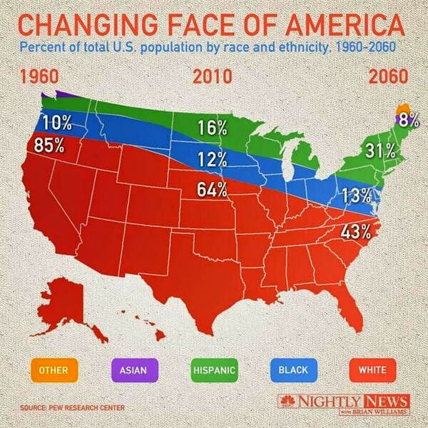
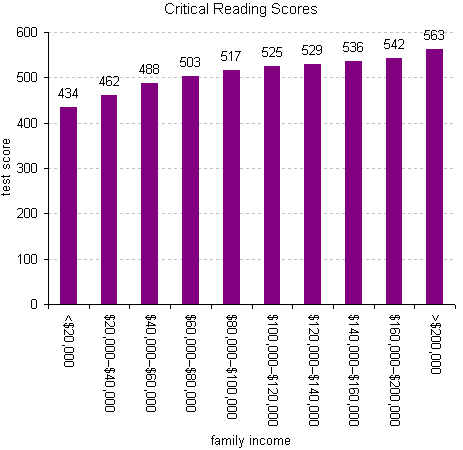
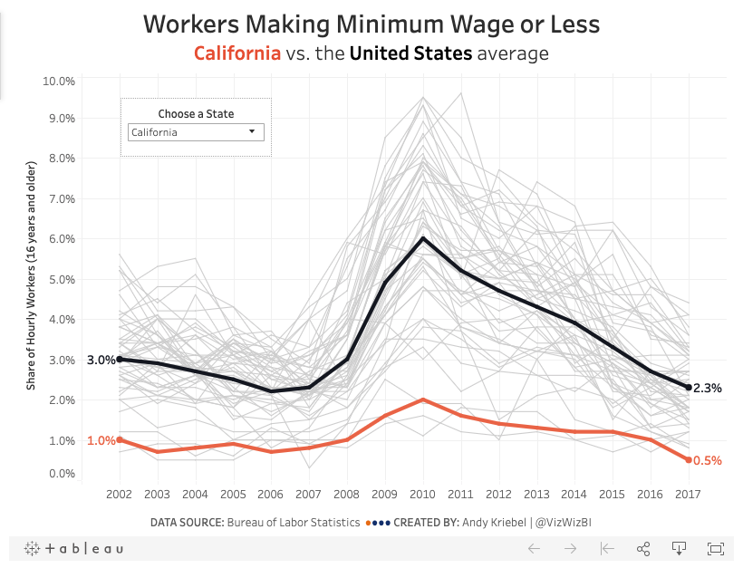
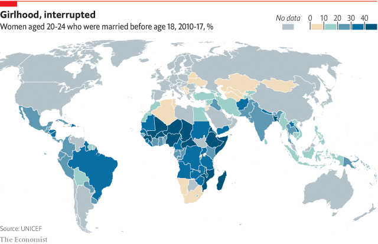

```{r setup, include=FALSE}
knitr::opts_chunk$set(echo = TRUE, message = FALSE)
```

# Exploration & Computation

# Question 1: Obtain a dataset (preferably of substantive interest/domain expertise)

Source: UNHCR Population Statistics; http://popstats.unhcr.org/en/time_series  

Description: This dataset includes the number of refugees, asylum-seekers, internally displaced persons, and others of concern  originating in Syria between 2000-2018, as well as country/territory of asylum/residence. The full data contain 2592 rows.  

```{r, warning=FALSE}
# Import libraries
library(tidyverse)
library(skimr)

# Import data (file called unhcr_popstats_syria.csv)
syria_data <- read.csv("~/Documents/_MSCAPP/Fall 2019/Unsupervised ML/PS1/Problem-Set-1/unhcr_popstats_syria.csv")

# Data exploration
# skim(syria_data)
summary(syria_data)
```

Note: I am having trouble knitting skim() to PDF, so have commented it out in place of summary() in several sections, but did consult both data overviews

```{r, warning=FALSE}
# Data tidying (filtering to 2012-2018)
dta_2008_2018 <- syria_data %>%
  rename(year=Year,
         country_origin=Origin,
         num_persons=Value,
         country_residence=Country...territory.of.asylum.residence,
         type=Population.type) %>%
  filter(year >= 2008) %>%
  mutate(country_origin = as.factor(country_origin),
         country_residence = as.factor(country_residence),
         type = as.character(type),
         num_persons = as.numeric(as.character(num_persons)))

# skim(dta_2008_2018)
summary(dta_2008_2018)
```

# Question 2: Choose a visual technique to illustrate your data

Selection: Two barplots

# Question 3: Now generate and present the visualization and describe what you see.

```{r}
grouped <- dta_2008_2018 %>%
           group_by(year, type) %>%
           summarise(total_persons = sum(num_persons, na.rm=TRUE)) %>%
           filter(type == "Internally displaced persons" |
                  type == "Refugees (incl. refugee-like situations)")

ggplot(data = grouped, aes(x = year, y = total_persons)) +
  geom_bar(width = 0.75, color="grey13", fill="salmon2", stat="identity") +
  facet_wrap( ~ type, scales = "fixed", ncol = 1) +
  geom_text(aes(label=total_persons), vjust=-0.3, size=2.5) +
  scale_x_discrete(limits=c(2008, 2009, 2010, 2011, 2012, 2013,
                            2014, 2015, 2016, 2017, 2018)) +
  scale_y_continuous(limit = c(0, 8000000), labels = scales::comma) +
  labs(x = "Year",
       y = "Number of Persons",
       title = "Syrian Refugees and IDPs, 2008-2018") +
  theme(plot.title = element_text(lineheight = 0.9, face="bold", hjust = 0.5),
        axis.text.x = element_text(size = 7),
        axis.text.y = element_text(size = 7),
        axis.title = element_text(size = 10))
```

Between 2008 and 2018, the number of Syrian refugees (including individuals in refugee-like situations) around the world increased by over 400x, from 15,211 to 6,654,339 persons. Following the start of the Syrian armed conflict  in 2011, the Syrian refugee population has experienced steady growth (2012 to 2018). Following the start of the conflict, UNHCR began to collect additional data on internally displaced persons (IDPs) and began to offer support in the form of provision of protection and community services. From 2012 to 2018, the number of IDPs in Syria has increased by a magnitude of over 4 million people. The country saw a spike in IDPs in 2014 at 7,632,500 persons, and since has seen a slight leveling off in number of IDPs. In 2018, Syria's 6,183,920 IDPs represented the biggest internally displaced population in the world.

```{r}
grouped2 <- dta_2008_2018 %>%
            filter(type == "Refugees (incl. refugee-like situations)" & year == 2018) %>%
            group_by(country_residence) %>%
            summarise(total_persons = sum(num_persons, na.rm=TRUE)) %>%
            arrange(-total_persons) %>%
            slice(1:5)

ggplot(data = grouped2, aes(x = reorder(country_residence, total_persons),
                            y = total_persons)) +
  geom_bar(width = 0.75, color="grey13", fill="darkseagreen3", stat="identity") +
  geom_text(aes(label=total_persons), hjust=-0.2, size=3) +
  labs(x = "Country of Current Residence",
       y = "Number of Persons",
       title = "Countries with the Highest Syrian Refugee Population, 2018") +
  theme(plot.title = element_text(lineheight = 0.9, face="bold", hjust = 0.5),
        axis.text.x = element_text(size = 7),
        axis.text.y = element_text(size = 11),
        axis.title = element_text(size = 9)) +
  scale_y_continuous(limit = c(0, 4000000), labels = scales::comma) +
  coord_flip()
```

In 2018, the 5 countries with the highest Syrian refugee populations, from highest to lowest, were Turkey (~3.62 million), Lebanon (~900 thousand), Jordan (~676 thousand), Germany (~523 thousand), and Iraq (~253 thousand). In fact, Turkey had nearly 3.84x the number of Syrian refugees that Lebanon, the second ranked country, had at that same time. Turkey had more Syrian refugees than the countries ranked 2 through 5 combined.

# Question 4: Calculate the common measures of central tendency and variation, and then display your results. 

Note: I am focussing on refugees and asylum-seekers by country and year for measures of central tendency, since IDPs are limited to Syria. Calculations include: Mean, Median, Mode, SD, Variance, and IQR. Final table appears following code.

```{r}
# Dataset to analyze (limiting to years following the start of the crisis)
crisis_data <- dta_2008_2018 %>%
               filter(year > 2011)

# Create an emtpy dataframe to store results
summary <- data.frame(measure=character(), value=double(),
                      row_of_data=character(), type=character(),
                      interpretation=character(), stringsAsFactors=FALSE)

# Create a function to calculate mode
mode <- function(options) {
  uniqv <- unique(options)
  uniqv[which.max(tabulate(match(options, uniqv)))]
}
```


```{r}
refugees <- crisis_data %>%
            filter(type == "Refugees (incl. refugee-like situations)")

# skim(refugees$num_persons)
summary(refugees$num_persons)
```

```{r}
num1 <- mean(refugees$num_persons, na.rm=TRUE)
num2 <- median(refugees$num_persons, na.rm=TRUE)
num3 <- mode(refugees$num_persons)
num4 <- var(refugees$num_persons, na.rm=TRUE)
num5 <- sd(refugees$num_persons, na.rm=TRUE)
num6 <- IQR(refugees$num_persons, na.rm=TRUE)

summary[nrow(summary) + 1,] = c("mean",
                                round(num1, digits=0),
                                "country per yr",
                                "refugees",
                                "Avg. refugees per country per year is 40866")
summary[nrow(summary) + 1,] = c("median",
                                round(num2, digits=0),
                                "country per yr",
                                "refugees",
                                "Median refugees per country per year is 56")
summary[nrow(summary) + 1,] = c("mode",
                                num3,
                                "country per yr",
                                "refugees",
                                "Mode refugees per country per year is 1")
summary[nrow(summary) + 1,] = c("variance",
                                round(num4, digits=1),
                                "country per yr",
                                "refugees",
                                "Variance of refugees per country per year is 67778122921")
summary[nrow(summary) + 1,] = c("SD",
                                round(num5, digits=1),
                                "country per yr",
                                "refugees",
                                "SD of refugees per country per year is 260342.3")
summary[nrow(summary) + 1,] = c("IQR",
                                num6,
                                "country per yr",
                                "refugees",
                                "IQR of refugees per country per year is 962")
```

The mean (average) number of Syrian refugees in any country during a single year, from 2012 to 2018, is 40,866 persons (Note that averages are among countries that had at least a single Syrian refugee during this time period). The median number of Syrian refugees in any country during a single year is 56 persons. The mode is 1. The standard deviation is equal to 260,342.3 and the inter-quartile range is 962.

```{r}
asylum <- crisis_data %>%
          filter(type == "Asylum-seekers")

# skim(asylum$num_persons)
summary(asylum$num_persons)
```

```{r}
num1 <- mean(asylum$num_persons, na.rm=TRUE)
num2 <- median(asylum$num_persons, na.rm=TRUE)
num3 <- mode(asylum$num_persons)
num4 <- var(asylum$num_persons, na.rm=TRUE)
num5 <- sd(asylum$num_persons, na.rm=TRUE)
num6 <- IQR(asylum$num_persons, na.rm=TRUE)

summary[nrow(summary) + 1,] = c("mean",
                                round(num1, digits=0),
                                "country per yr",
                                "asylum seekers",
                                "Avg. asylum seekers per country per year is 1273")
summary[nrow(summary) + 1,] = c("median",
                                round(num2, digits=0),
                                "country per yr",
                                "asylum seekers",
                                "Median asylum seekers per country per year is 24")
summary[nrow(summary) + 1,] = c("mode",
                                num3,
                                "country per yr",
                                "asylum seekers",
                                "Mode asylum seekers per country per year is 1")
summary[nrow(summary) + 1,] = c("variance",
                                round(num4, digits=1),
                                "country per yr",
                                "asylum seekers",
                                "Variance of asylum seekers per country per year is 45868680")
summary[nrow(summary) + 1,] = c("SD",
                                round(num5, digits=1),
                                "country per yr",
                                "asylum seekers",
                                "SD of asylum seekers per country per year is 6772.6")
summary[nrow(summary) + 1,] = c("IQR",
                                num6,
                                "country per yr",
                                "asylum seekers",
                                "IQR of asylum seekers per country per year is 251")
```

The mean (average) number of Syrian asylum-seekers in any country during a single year, from 2012 to 2018, is 1,273 persons (Note that averages are among countries that had at least a single Syrian refugee during this time period). The median number of Syrian asylum-seeekers in any country during a single year is 24 persons. The mode is 1. The standard deviation is equal to 6772.642.

```{r}
kable(summary,
      format = 'pandoc',
      caption="Measures of Central Tendancy and Variation")
```

# Question 5: Describe the numeric output in substantive terms, eg, What do these numeric descriptions of data reveal? Why is this important? What might you infer about the distribution or spread of the data? Why? Etc.

Because a single row of data represents the number of Syrian displaced persons in a single country each year, and the included countries are those that have been home to at least one displaced Syrian person since 2000, there is significant variation in the results. Specifically, for the number of Syrian refugees residing in each country each year, an arithmetic mean of 40,866 persons indicates that there has been an average of over 40K Syrian refugees residing in each country in the dataset since the start of the conflict. However, a median value of 56 persons indicates a significant skew in the data. There are a few countries that have been home to over 1 million Syrian refugees in a given year, and these high magnitude countries skew the mean towards a higher value than is necessarily representative of the full dataset. In fact, 50% of countries in the dataset are home to equal to or less than 56 Syrian refugees each year, which is a drastically lower estimate. This is further confirmed by a mode value of 1, which indicates that the greatest number of countries reported having only a single Syrian refugee in a given year. Nevertheless, this information is important in substantive terms because it indicates that a few countries have been experiencing an incredible influx of Syrian refugees on an annual basis since the beginning of the conflict, and that people are looking to find refuge in countries across the world.  

Similarly, for the number of Syrian asylum-seekers residing in each country each year, an arithmetic mean of 1,273 persons indicates that there has been an average of over 1K Syrian asylum-seekers residing in each country in the dataset since the start of the conflict. A median value of 24 persons again indicates a significant skew in the data, where extreme values are shifting the mean towards a higher value. This is again confirmed by a mode value of 1, which means that the greatest number of countries reported having only a single Syrian asylum-seeker in a given year. If I were using this data for a research project, I would be interested to further explore these low values and verify how UNHCR encodes its measures. Nevertheless, this data is important because it reveals that countries around the world have been consistently receiving Syrian asylum-seekers on an annual basis since the beginning of the conflict.  

Furthermore, standard deviation is a number that indicates how measurements for a group are spread out from the mean. A low standard deviation indicates that most of the numbers are close to the average value, whereas a high standard deviation indicates that many of the numbers are very spread out. In the first example (Syrian refugees), a standard deviation of 260,342 persons on a mean of 40,866 persons indicates that about 68% of countries with at least one Syrian refugee have between 0 and 301,208 Syrian refugees in a single year, and that 95% of countries have between 0 and 561,550 Syrian refugees. Again, this confirms the existence of a few key outliers in the dataset. Interquartile range tells you the difference between the 3rd and 1st quartile in a dataset. It is essentially another measure of spread with a higher resistance to outliers. Interestingly, IQR for this population is only 962, which describes the middle 50% of values when ordered from lowest to highest.  

In the second example (Syrian asylum-seekers), a standard deviation of 6,773 persons on a mean of 1,273 persons indicates that about 68% of countries with at least one Syrian refugee have between 0 and 8,046 Syrian asylum-seekers in a single year, and that 95% of countries have between 0 and 14,819 Syrian asylum-seekers. IQR for this population is 251, which again describes the middle 50% of values when ordered from lowest to highest. For perspective, the total number of persons granted asylum in the United States, from any country, was 26,568 persons in 2017.  

# Critical Thinking

# Question 1: Describe the different information contained in/revealed by visual versus numeric exploratory data analysis

Visual exploratory data analysis (EDA) is ideal for summarizing datasets in a way that makes it easy for human beings to understand. It reveals broad relationships, patterns, and trends in data, such as how two continuous variables are related or perhaps when there has been a rapid increase in a specific measure. Visual EDA also reveals clusters and groupings in data. It can be leveraged to tell a particular story or narrative, by prompting the observer to focus on a particular mark or section of the page where he/she may have otherwise been inclined to look elsewhere. An interactive dashboard has the added benefit of story communication, and can allow the observer to quickly answer questions about data as they arise. Finally, visual EDA can remove noise in the data, narrow one’s search, reveal insights about a sub-population, and highlight both errors and outliers.

Numeric EDA, on the other hand, is ideal for revealing information about the spread of a dataset and particulars about magnitude. For instance, is easy to compare summary statistics that have been condensed down to a few specific values with what one expects, to ensure that the data are accurate in the first place. Additionally, numeric EDA helps with comparing two datasets and summarizing the differences between two groups. It reveals how a single, new piece of data compares to an entire dataset, such as how a data point fits into a larger narrative. It also reveals specific characteristics of data themselves, like rounding and units of analysis. It is often used for checking assumptions, handling missing values, and identifying variable transformations. Finally, while visual EDA is helpful for identifying outliers, numeric EDA is best for determining which specific rows of data contain these extreme values for data cleaning purposes.

# Question 2: Find (an include) two examples of "bad" visualizations and tell me precisely why they're bad.

`````{r}

```
Source: https://flowingdata.com/2014/04/16/weird-stacked-area-map-thing/

1. There are too many conflicting scales and axes in this visualization. Left to right represents time, as well as location on a map. Top to bottom appears to represent percent of total, as well as location on a map. A map truly should not be used at all in this context if the goal is to understand percent change of demographics over time.  

2. From top to bottom, the percentages do not consistently (or ever) add up to 100%. For instance, under 1960, the values add up to 95%, under 2010 the values add up to 92%, and under 2060 the values add up to 95%.  

3. By overlaying percentages on a map, the visualization appears to indicate that white people only live in the southern part of the US, whereas black people live in separate locations that are geographically north of white people, and that again Hispanic populations live geographically north of black people in distinct locations. This, of course, is completely false.  

4. The legend should probably be reversed in order, with the more prevalent colors appearing first for easy reference. In other words, the references for white, black, and Hispanic should appear before other and Asian.  

5. This visualization dramatically smooths trends, indicating that racial and ethnic groups are steadily increasing or decreasing in size over time. It completely hides any localized, time-specific variation.  

6. No footnote or explanation is given as to how the author calculated projections out to 2060. Therefore, it is very unlikely that forecasts to this date are accurate or can be trusted.  

`````{r}

```
Source: https://economix.blogs.nytimes.com/2009/08/27/sat-scores-and-family-income/?_php=true&_type=blogs&_php=true&_type=blogs&_r=1

1. This graph does not have a descriptive title. I believe it is trying to convey average SAT Critical Reading scores by family income group in 2009, but the title does not mention exam type, year, or measure of central tendency.  

2. The visualization makes no mention of sample size per income group. For instance, it could be the case that only 10 students indicated having a family income of less than \$20K, as compared to 1000 students in the \$20K-\$40K range. Therefore, it is difficult to tell if these average scores are representative of each income group, and if they have been weighted in some way.  

3. Because the x-axis includes repeated values (eg. \$60K appears in two different categories), it is unclear where students at the margins are included. For instance, are the scores of students with a family income of \$60K double counted?  

4. The second to last bar has a different x-axis range than each of the other bars. Specifically, the first 9 bars have a $20K range, whereas this one bar has a \$40K range.  

5. The y-axis is misleading, since 600 is not the total number of possible points that can be obtained in this section of the exam.  

# Question 3: Find (an include) two examples of "good" visualizations and tell me precisely why they're good.

`````{r}

```
Source: http://www.vizwiz.com/2019/01/minimum-wage.html

1. This visualization is compelling because it reduces noise by highlighting the specific values of interest using a drop-down parameter selection. It is interactive, and allows the end user to select a specific state of interest to compare with the US average over time.  

2. The legend is creatively incorporated into the title of the visualization. The state name dynamically changes based on selection, and the red color of the state line corresponds with the red color of the state name in the title.  

3. The x-axis scale is clear and consistent (years, 2002-2017) and the y-axis scale is clear and consistent (share of hourly workers age 16+, 0-10%).  

4. I like the use of percentages rather than absolute numbers, because share of hourly workers lends itself to a standardized comparison.  

5. This visualization only uses three colors, rather than overwhelming the observer with unnecessary embellishments. The gray lines provide a subtle indication of variation across all states (national range), the red line is the mark of interest, and the black line is always the US average.  

6. The visualization focuses on trends over time, only providing labels at the ends of lines to highlight growth or reduction in absolute terms, rather than crowding the image with too many point labels.  

`````{r}

```
Source: https://www.economist.com/graphic-detail/2019/09/26/indonesia-has-banned-marriage-for-young-girlsgood_

1. The title and caption are very descriptive, conveying to observers exactly what the data represents (women aged 20-24 who were married before age 18) as well as the dates included in the data (2010-17) and the unit (%). Percentage of a population group is a good, standardized way to draw comparisons between locations.  

2. This visualization highlights global trends rather than creating unnecessary noise and providing excess labels. It is clear from looking at it which countries and regions have higher and lower percentages of women married before 18 during the specified timeframe.  

3. The color palette/scale is inviting and color blind compliant. The visualization provides 5 distinct color ranges, and makes clear that gray indicates no data availability. The colors are not too similar, and therefore they can be easily parsed out.  

4. A choropleth is a visually appealing and minimalist way to display clear comparisons between geographic locations.  

5. The legend is broken down into consistently sized sections: 0-10, 10-20, 20-30, 30-40, 40+, which eliminates any confusion or need for additional standardization.  

# Question 4: When might we use EDA and why/how does it help the research process?

EDA is particularly helpful at the very beginning of any research workflow to help validate and explore a new data source. If there is already a known question, it can be used develop a hypothesis, such as that one feature is causally related to another or that a group of features can together be used to accurately predict an outcome. While we might use EDA when deciding whether to use a dataset to answer a known question, we can also use it to check assumptions or to explore a dataset of interest without having a specific question in mind. In other words, EDA may lead to the development of new ideas and questions. Furthermore, while EDA can be used as a precursor to a larger project, it can also be a project in itself, where the end result is a visualization that conveys a story to a wider audience.  

Next, EDA can be used iteratively throughout research, to see how distributions, clusters, and trends change during cleaning and data transformation, and to ensure they are changing in expected ways. It can also be used to refine the selection of feature variables that will be used in a study, known as feature reduction. At the end of a project, EDA can help researchers to develop follow up questions by revealing new, unanticipated gaps or trends in the data to explore moving forward.  

EDA helps the research process in several additional ways. It can be used to discover unanticipated anomalies, trends, or clusters in the data, and allows us to quickly compare measures of central tendency and variation with our expectations. EDA helps a researcher to anticipate whether future results will be valid and correctly interpreted, and can help to determine if the dataset is appropriate to use to answer a particular question in the first place. We might use EDA to learn about patterns assumption-free, and to reveal unexpected relationships. Additionally, it can be used to reveal corrections that need to be made if the dataset is going to be used for a project, such as accounting for null values, outliers, questionable variable types, or necessary transformations. Finally, EDA helps us to summarize datasets in a way that makes it easy for humans to understand and interpret, by removing noise.

# Question 5: What did John Tukey mean by "confirmatory" versus "exploratory"? Give me an example for each.

Confirmatory data analysis (CDA) refers to the process of using a set of random variables to model, test, and confirm or disprove a hypothesis. It involves evaluating evidence using traditional statistical tools, techniques, and methods such as significance, confidence, and inference, and also involves challenging assumptions. The process of CDA includes quantifying deviation explained by a model versus that explained by chance, and producing estimates. An example of CDA would be running a linear regression to test the hypothesis that a given feature is causally related to an outcome variable, producing a set of estimates, and determining the variance and significance of these estimates. For instance, you might have a dataset that contains data on 100 students, their demographics, how many hours they studied for an exam, and their final score on the exam, formulate the hypothesis that studying more hours will lead to higher test scores, and regress these features on the outcome variable to establish causality at a statistically significant level.  

On the other hand, exploratory data analysis (EDA) refers to the “detective work” one applies to data as a first step in the data analysis process. It involves establishing data’s underlying structure, identifying anomalies and missing data, identifying key variables, checking assumptions, and beginning to parse out what models can be applied to the data using the fewest possible predictor variables. It may take the form of transformations, graphs, tables, and data visualizations, and has unclear rules by nature, as it is more of an approach. This process can actually lead to the formulation of new questions and new hypotheses. EDA helps you to make sense of your data, establish questions to ask, and determine the best way to present and manipulate data to uncover insights. It is important to note that EDA is not in opposition to CDA, but rather, works in tandem. An example of EDA would be taking a dataset on retail sales, building a bar chart to understand how sales vary by location (a dimension in the data), and then perhaps overlaying color on each bar to understand revenue by location. It may then involve creating a line graph of sales over time to discover any spikes, without having a specific set questions you are attempting to answer.
