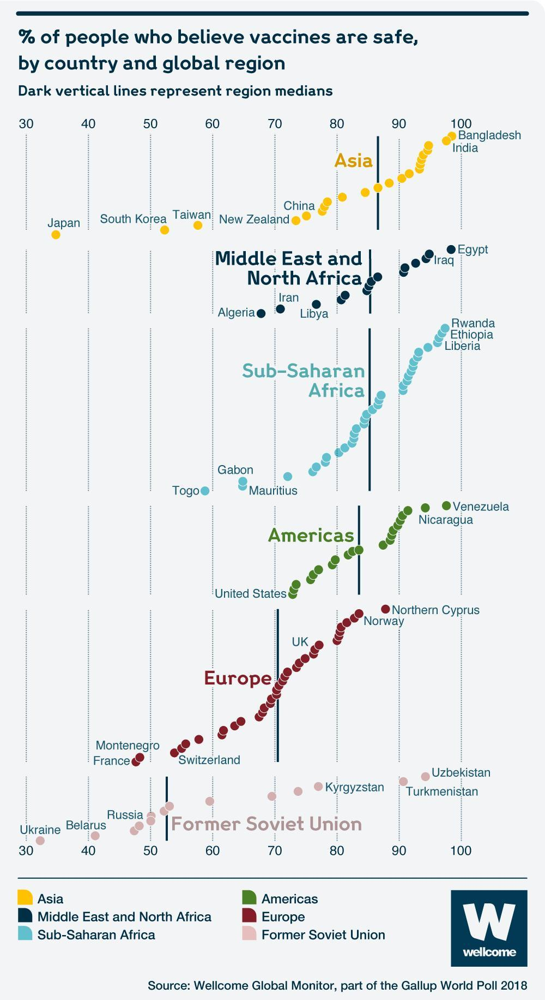
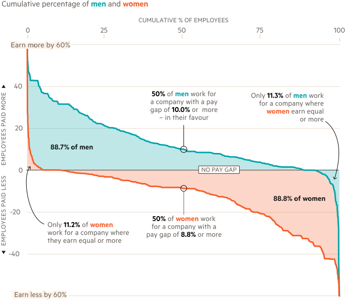
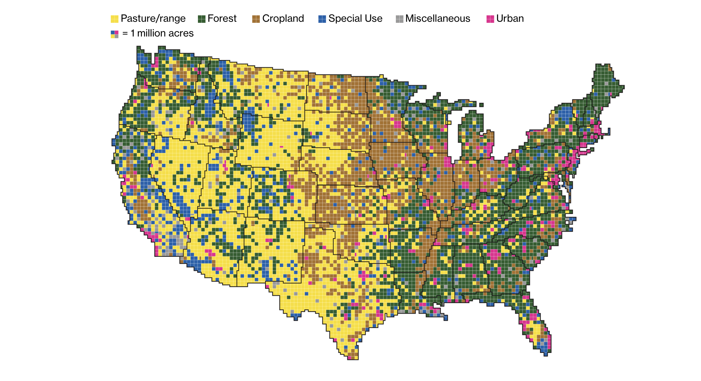

```{r setup, include=FALSE}
knitr::opts_chunk$set(echo = TRUE)
```

#### I chose to combine two datasets: one details the number of mass shootings by State in the U.S. in 2019, and the other summarizes gun laws by state. The mass shootings data is of shooting incidents where 2 or more people were killed or injured.

```{r loading and joining the data}
library(tidyverse)
library(skimr)
library(plotly)

mass_shootings <- read_csv("mass_shootings.csv")
gun_laws <- read_csv("data.csv")
states_abb <- read_csv("states.csv")

il <- c("Illinois", "TRUE", "TRUE", "TRUE", "FALSE")
gun_laws_final <- rbind(gun_laws, il)
gun_laws_w_abbr <- left_join(gun_laws_final, states_abb, by = "State")
joined_data <- left_join(mass_shootings, gun_laws_w_abbr, by="State")
```

#### Taking a look at N/A values below, I noticed that the NA values for laws in DC are because DC is technically not a state. Also, there are some ambiguities around open carry in CA and CO. 

```{r inspecting NAs}
## inspecting NAs
joined_data_na <- joined_data %>%
  filter(is.na(firearmRegRequired))
joined_data_na
```

#### Moving on to data viz, I chose to show the count of incidents and number of deaths by State in states where a permit is required to purchase a gun versus those where a permit is not required to purchase a gun. I was interested in this because people often question whether stricter gun laws would lead to fewer mass shootings.

```{r data viz, echo=FALSE}
sum_req <- joined_data %>%
  rename(n_killed = "# Killed") %>%
  filter(State != "District of Columbia") %>%
  group_by(permitReqToPurchase) %>%
  summarize(count_deaths = sum(n_killed),
            count_incidents = n())

sum_req %>%
  ggplot() +
  geom_bar(aes(x = permitReqToPurchase, y = count_deaths), stat = "identity") +
  labs(x = "Whether or Not Permit Required to Purchase",
       y = "Number of Deaths",
       title = "Number of Deaths by Purchase Permit Law") +
  theme_bw()

```
#### There were 74 more incidents of mass shootings in states where they require a permit for purchase. Also striking, as shown by the bar plot above, is that there were more than double the amount of people killed when the incidents happened in states that did not require a permit versus incidents that happened in states that did require a permit.

#### Finally, below I created an interactive scatter plot to examine the number of incidents and count of deaths by State. Mass shootings in Texas appeared to have the highest number of deaths, and the third highest number of incidents. CA and IL both had 36 incidents, while CA had double the amount of deaths. The plot cannot be viewed in pdf format.

```{r data viz2, echo=FALSE}
incidents_by_state <- joined_data %>%
  rename(n_killed = "# Killed") %>%
  filter(State != "District of Columbia") %>%
  group_by(Abbreviation, permitReqToPurchase) %>%
  summarize(count_incidents = n(),
            count_deaths = sum(n_killed)) 

scatter <- plot_ly(incidents_by_state,
                   x = ~count_incidents,
                   y = ~count_deaths, 
                   type = "scatter", 
                   text = incidents_by_state$Abbreviation, 
                   mode = "markers") %>%
layout(title = 'Number of Incidents and Number of Deaths by State',
         xaxis = list(title = 'Count of Incidents'),
         yaxis = list(title = 'Count of Deaths'))
```
#### Next, I summarized the data.
```{r summary stats, echo=FALSE}
skim(joined_data)
```

#### The 7 missing values for Abbreviation, firearmRegRequired, permitReqtoCarry, and permitReqToPurchase are attributable to the 7 incidents that occured in DC. The missing values for openCarryLegal are due to incidents in DC, but also IL and CO, which seem to have ambiguous open carry laws, where open carry is allowed in some circumstances but not others.

#### The only two numeric variables are # Injured and # Killed. The mean number of people injured in a mass shooting in 2019 (so far) was 4.07, and the median was 4. The median number of people killed in a mass shooting in 2019 (so far) was 1. But there are large outliers, with the shooting in El Paso, TX, killing 22 people and injuring 24. This is important because it tells us that there are many smaller incidents (with fewer casualties) but a long tail of larger incidents as well.

#### Below I show histograms for the number of killed and number of injured variables. This confirms more clearly how skewed the distribution is towards smaller events, but how long the right tail of the distribution is. 

```{r summary stats2, echo=FALSE}
hist(joined_data$`# Killed`)
hist(joined_data$`# Injured`)
```

###Critical Thinking

#### 1. Visual data analysis is used when we would like to understand broader patterns in the data, and compare levels of characteristics. For example, boxplots and histograms can be used to quickly determine the skewness of the data. On the other hand, we may use numerical exploratory data analysis, such as common central tendency summaries like mean, median, variance, etc. to see patterns in the numbers and report a specific snapshot of the data. These numerical analyses can usually be more easily compared across datasets.  

#### 2. Here are two bad examples of data viz:


#### The first one is an example of bad data viz for two reasons. Firstly, as a pie chart, it is very hard to compare the relative sizes of the sections. Second, the pie chart does not even add up to 100%.



#### This second one is an example of bad dataviz because there is no clear y-axis so it is very unclear how we would even be comparing the levels of the dots for the various countries. 

#### 3. Here are two good examples of dataviz:



#### The first one shows the gender pay gap in the UK. The use of a density plot of differences very clearly shows the distributional differences in male wages compared to female wages. The labels/text and colors clearly highlight the area under the curves, and which gender group each line represents.



#### The second one shows how the United States uses its land. The scaling on the map and the colors easily tell us a story of the uses of U.S. land. The original is interactive, and the map also has a useful scale/bar at the top for clarity on how many acres each little square represents.

#### 4. We use EDA when we are first delving into a dataset and we want to see what general trends hold before conducting a more rigorous analysis using regressions or other models. EDA particularly helps us identify outliers, explore clustering, check whether assumptions in the data generation process are correct, and to compare mean differences.

#### 5. Exploratory data analysis involves analyzing a dataset and going in without expectations of what it might show us. For example, I did not have any prior ideas of what the trends in gun violence are in 2019, so I found this dataset and ran simple summary statistics and created charts. As a result, I found an interesting trend that there were twice as many mass shooting deaths in states where a permit is not required to purchase a gun. Confirmatory analysis on the other hand involves modeling such as testing hypothesis through regression analysis. This type of analysis is when we would test the validity or significance of the trends found in an exploratory process. For example, now that I have done EDA on this dataset I may be interested in running a regression to see which variables significantly predict the number of deaths or injuries in a given state.
